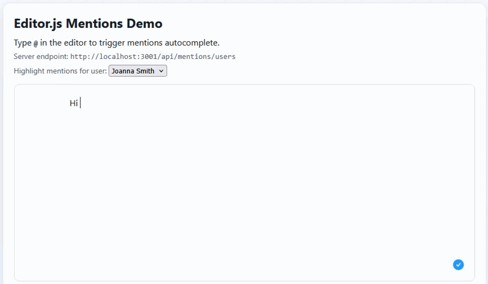

# editorjs-mentions

[](https://github.com/your-org/editorjs-mentions)
[](https://www.npmjs.com/package/@editorjs-mentions/plugin)
[](https://www.npmjs.com/package/@editorjs-mentions/plugin)
[](https://github.com/your-org/editorjs-mentions/blob/main/LICENSE)
[](https://github.com/your-org/editorjs-mentions/issues)
[](https://www.npmjs.com/package/@editorjs/editorjs)

`editorjs-mentions` is an Editor.js plugin that enables mention-style autocomplete (similar to JIRA/Confluence).



## Features

- Trigger autocomplete with `@` (or custom trigger symbols).
- Pluggable provider API for mention data.
- Standard mention model:
  - `id: string`
  - `displayName: string`
  - `description?: string`
  - `image?: string`
  - `link?: string`
- Sample REST server with:
  - in-memory demo users
  - Active Directory-backed example provider

## Monorepo Layout

- `packages/editorjs-mentions`: plugin package (TypeScript)
- `examples/server`: sample REST backend (Express + TypeScript)
- `examples/demo`: minimal integration example

## Quick Start

```bash
npm install
npm run build
```

Run sample server:

```bash
npm run dev:server
```

Run demo app:

```bash
npm run dev:demo
```

## Plugin Usage

```ts
import EditorJS from "@editorjs/editorjs";
import {
  EditorJSMentions,
  createRestMentionProvider,
  encodeMentionsInOutput,
  decodeMentionsInOutput
} from "@editorjs-mentions/plugin";

const editor = new EditorJS({
  holder: "editor"
});

await editor.isReady;

const mentions = new EditorJSMentions({
  holder: "editor",
  triggerSymbols: ["@"],
  mentionRenderContext: { currentUserId: "u-1002" },
  renderMention: ({ item, defaultText, element, context }) => {
    const ctx = context as { currentUserId?: string } | undefined;
    element.textContent = defaultText;
    element.style.fontWeight = ctx?.currentUserId === item.id ? "700" : "400";
  },
  provider: createRestMentionProvider({
    endpoint: "http://localhost:3001/api/mentions/users"
  })
});

mentions.setMentionRenderContext({ currentUserId: "u-1001" });

const nativeOutput = await editor.save();
const payloadForServer = encodeMentionsInOutput(nativeOutput);
const payloadForEditor = decodeMentionsInOutput(payloadForServer);

// later:
// mentions.destroy();
```

## Mention Provider Contract

The plugin consumes this model:

```ts
type MentionItem = {
  id: string;
  displayName: string;
  description?: string;
  image?: string;
  link?: string;
};
```

## Persisting Mention IDs

Use `encodeMentionsInOutput(editor.save())` to convert display HTML into structured entities:

```json
{
  "type": "paragraph",
  "data": {
    "text": "@John Doe @Raj Patel",
    "entities": [
      { "type": "mention", "id": "u-1001", "displayName": "John Doe", "start": 0, "end": 9 }
    ]
  }
}
```

Providers implement:

```ts
type MentionProvider = (query: {
  trigger: string;
  query: string;
  limit: number;
}) => Promise<MentionItem[]>;
```

or:

```ts
interface MentionProviderObject {
  search(query: MentionQuery): Promise<MentionItem[]>;
}
```

## REST API Example

`GET /api/mentions/users?query=jo&trigger=@&limit=8`

Response:

```json
{
  "items": [
    {
      "id": "u-1001",
      "displayName": "John Doe",
      "description": "Engineering",
      "image": "https://..."
    }
  ]
}
```

## Active Directory Example

See `examples/server/.env.example` and set:

- `AD_ENABLED=true`
- `AD_URL`
- `AD_BIND_DN`
- `AD_BIND_PASSWORD`
- `AD_BASE_DN`

When enabled, the server switches to LDAP-backed lookup.

For quick local LDAP testing with Docker, see `examples/server/README.md`.

Shortcuts:

- `npm run dev:ldap:up`
- `npm run dev:ldap:down`

## Release & Publish

Before publishing `@editorjs-mentions/plugin`:

1. Update plugin metadata URLs in `packages/editorjs-mentions/package.json`:
   - `repository.url`
   - `bugs.url`
   - `homepage`
2. Bump version in `packages/editorjs-mentions/package.json`.
3. Build and typecheck:
   - `npm run typecheck --workspace @editorjs-mentions/plugin`
   - `npm run build --workspace @editorjs-mentions/plugin`
4. Publish from package directory:
   - `npm publish --access public --workspace @editorjs-mentions/plugin`

License: MIT (`LICENSE`).

## GitHub Actions

- CI build workflow: `.github/workflows/ci.yml`
- npm publish workflow: `.github/workflows/publish-npm.yml`

For npm publish workflow, configure repository secret:

- `NPM_TOKEN` - npm automation token with publish permissions for `@editorjs-mentions/plugin`.
